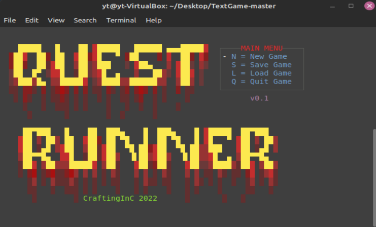

# Text Game - Quest Runner  
  
Just a Text Game coded in C
  
WINDOWS : PASSES  
LINUX   : PASSES  
  
#### COMPILE WITH GCC TESTED

    WINDOWS : gcc -Wall -m64 -Os -static main.c vts.c -o questrunner -s  
    LINUX   : gcc -Wall -m64 -Os -static main.c vts.c linuxfunctions.c -o questrunner -s  

#### NOTES  
This game is a work in progress. It is not finished yet.  
  
Your OS must support XTERM for linux or enable VTS in Windows 10+.  
  
Windows 7 and older does not support VTS.  
  
  WINDOWS    
  
  
  LINUX  
  
